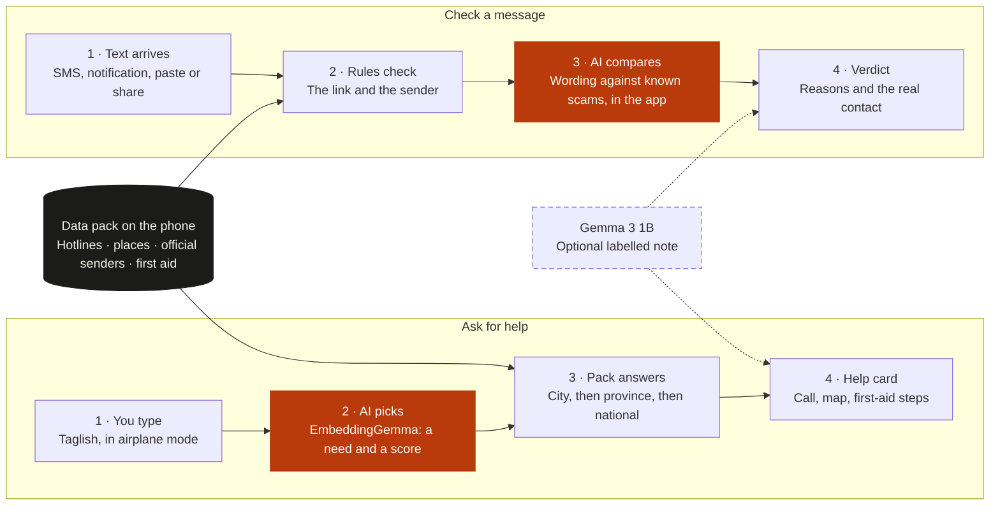

# Hudyat

**Hudyat** ("signal") is an Android app that runs AI on a budget phone to
do two things with no internet: tell you who to call and where to go in an
emergency, and warn you when a message looks like a scam.

> Hudyat is the official information you can trust when you can't get
> online: who to call, where to go, and whether a message is real.

- **Event:** [AppBuildersPH Hackathon 2026](https://appbuildersph.com/hackathon/), theme "Local AI"
- **Team:** Ian Labicani (solo)
- **Test phone:** Infinix X6876 (Dimensity 7400, 8 GB RAM), Android 16
- **Demo video:** [YouTube](https://youtu.be/9C22Za7qfuY) ·
  [LinkedIn post](https://lnkd.in/p/g9Qu9EmB)
- **Promotional video:** [YouTube Shorts](https://www.youtube.com/shorts/iGo4yqNbMuU)

## What it does

- **Find help.** Type what happened in Taglish. The phone works out what
  you need and shows the hotline for your city, the nearest places, and
  a fixed first-aid card when one applies.
- **Offline map.** Places are shown on a Metro Manila map stored on the
  phone.
- **Check a message.** Paste, share or select a message. The result gives
  a verdict, the reasons, and the real contact of whoever it claims to be.
- **Automatic checking.** Once switched on, incoming texts are checked,
  a likely scam raises an alert, and a home screen widget keeps count.
- **Everyday lookup.** Search agencies, local officials, hotlines and
  government services.

## Why the AI runs on the phone

> A typhoon takes the signal at the exact moment people need help. Hudyat
> keeps the data and the AI on a budget phone, so it still works, and
> nothing you type or receive, from your emergency to your private
> messages, leaves the device.

Two reasons, and they hold separately:

- **No signal.** The emergency flow has to work in airplane mode.
- **Privacy.** A scam checker reads your messages. That is only
  acceptable if they never leave the phone, even when you are online.

## What runs on the phone, and what needs internet

| Runs on the phone, offline | Needs internet |
|---|---|
| Both AI models | Opening a government service's website |
| Understanding a typed request | Directions in another maps app |
| Hotline, agency and official lookup | Downloading the models, if they are not copied over by cable |
| Nearest places and the offline map | Rebuilding the data pack on a laptop |
| First-aid cards | |
| Every message check, alert and saved result | |

Hudyat has no server of its own and calls no cloud AI service.

## How it works

Two paths on one phone, with no network in either.

Orange is where a model runs, dark is fixed data, and dashed is optional.
A text that arrives while the app is closed is checked by the rules
alone; the wording check runs inside the app.

## How the AI is used

Two open models run on the phone. Neither was trained by us.

| Model | Job |
|---|---|
| EmbeddingGemma (about 300M) | Matches a typed request to one of a fixed list of needs, picks a first-aid card, and compares a message's wording with known scam wording |
| Gemma 3 1B | Writes one or two sentences under a card or result, labelled "AI-written" |

**A small model on a small phone is best used to understand and route,
not to know and answer.** It cannot hold reliable facts, but it can tell
what a Taglish message means and point it to the right piece of data.
Hudyat is built around that limit.

The design assumes a small model will sometimes be wrong:

- **The data is the knowledge.** Every phone number, address, website and
  first-aid step is copied from the data pack. The AI never writes them.
- **Rules come first in the message check.** Links, claimed senders and
  gambling promos are checked against official data by rules. The AI
  wording check is a second signal and cannot mark a message "Mukhang
  scam" on its own.
- **It never says "safe".** The best result is "Walang nakitang
  problema", with a note that this is not a guarantee.
- **Everything degrades.** With no model installed, the quick buttons,
  keyword search, cards and every rule still work.

More in [How the AI works](docs/AI.md).

## What makes Hudyat different

- **One pack answers both questions.** The official data that finds a
  hotline also checks a message. When a text pretends to be GCash or the
  DSWD, Hudyat compares its link with the real website and shows the
  real number with a Call button.
- **Reasons you can check, not a score.** Each verdict lists its reasons
  in fixed wording, such as "the link imitates an organisation" or "the
  link is broken up to get past filters".
- **Built for how texts arrive here.** Taglish, sender names that can be
  faked, short links, links split with a space, and online gambling
  promos.

## Try it in two minutes

You need an Android phone running Android 11 or later.

1. **Install the app.** Use the APK on this repository's Releases page if
   one is attached, or [build it](docs/BUILD.md).
2. **Open Hudyat and continue past Setup.** The data and the map are
   inside the app.
3. **Turn on airplane mode.**

### Check a message

On Home, tap **Check a message**, paste one of these, and tap **Check**.
These work before the AI models are installed.

| Paste this | Expected verdict | Why |
|---|---|---|
| `GCash: I-verify ang account mo sa https://gcash-verify.com` | Mukhang scam | The link imitates GCash but is not its website |
| `Mula sa DSWD: kunin ang ayuda sa dswd-ayuda.net ngayon` | Mukhang scam | The link imitates DSWD |
| `Para sa refund, pumunta sa csraftersales. com at pakitanggal ang space` | Mukhang scam | The link is broken up to get past filters |
| `Congrats! Claim your 100% welcome bonus, free spins at cashback sa https://lucky-casino88.com` | Mag-ingat | An online gambling promo |
| `Ma, nakauwi na ako. Anong ulam natin mamaya?` | Walang nakitang problema | Nothing found |

### Ask for help

On Home, type one of these under **What happened?** and tap **Find
help**. Pick a city if the phone has no GPS fix.

| Type this | Expected card |
|---|---|
| `Tumataas ang tubig, nasa bubong na kami ng pamilya ko` | Flood rescue, with the city's disaster hotline |
| `May sunog dito sa compound namin, mabilis kumalat` | Fire, with the fire hotline and nearest fire stations |
| `Nabagsakan ng kahoy ang paa ni tatay, namamaga at hindi maigalaw` | Injury, with nearest hospitals and a first-aid card when one matches |
| `Ubos na ang gamot sa high blood ni mama, saan may botika` | Medicine, with nearest pharmacies |

Without the AI models, typing runs a keyword search and the quick buttons
open the most common cards. The models are not inside the APK;
[the build guide](docs/BUILD.md#5-copy-the-models-first-install-only)
shows how to add them.

## Disclosures

- **Models:**
  [EmbeddingGemma](https://huggingface.co/litert-community/embeddinggemma-300m)
  and [Gemma 3 1B](https://huggingface.co/litert-community/Gemma3-1B-IT),
  Google's open models under the
  [Gemma terms](https://ai.google.dev/gemma/terms). Not trained or
  fine-tuned for this project.
- **Technologies and frameworks:** Flutter and Dart; Kotlin for the
  background checks and widget; `flutter_edge_ai` for on-device models;
  `sqlite3` with FTS5; `maplibre_gl` with PMTiles; Bun and TypeScript for
  the data pack builder.
- **APIs and cloud services:** none at run time. At build time only:
  GitHub, the OpenStreetMap Overpass API, the Protomaps daily build and
  Hugging Face.
- **Data:** [BetterGov](https://github.com/bettergovph/bettergov) open
  data (CC0), [BetterGov hotlines](https://github.com/bettergovph/hotlines)
  (no licence listed),
  [OpenStreetMap](https://www.openstreetmap.org/copyright) (ODbL),
  company websites, and first-aid guidance from the British Red Cross,
  MedlinePlus and the WHO. Every source, what was taken and what is
  incomplete is in [Where the data comes from](docs/DATA.md).
- **Synthetic data:** the 42 scam phrases and 169 labelled examples were
  written for this project, most by an AI assistant. They are never used
  as test data.
- **Existing code and assets:** the app was built during the hackathon.
  The scheduled-alarm approach and coding conventions follow the
  builder's earlier apps, Barya and AfterYou. Fonts are Atkinson
  Hyperlegible and IBM Plex Mono (SIL Open Font License).
- **AI development tools:** Claude Code, Devin and Codex.
- **Demo video:** animated with [Remotion](https://www.remotion.dev),
  voice-over by [ElevenLabs](https://elevenlabs.io). The app screens in
  it are recreated, not recorded.
- **Affiliation:** Hudyat is independent and is not endorsed by BetterGov
  or any agency.

## Limitations

- **It cannot prove a message is safe**, confirm a sender name, or see
  where a shortened link goes while offline.
- **It does not block or delete messages.**
- **The map and places cover Metro Manila only.** Hotlines and the
  directory are nationwide.
- **Contacts can go out of date.** Every card shows the pack's build
  date.
- **Messaging apps are seen only through their notifications**, which
  can cut a long message short.
- **First-aid cards are not a substitute for emergency care.**
- **The AI wording check is modest.** In an early test on the phone it
  caught 12 of 20 synthetic scam examples while flagging none of 25
  ordinary messages. This is not a real-world accuracy figure.
- **A five-label classifier is built but switched off.** It has not been
  measured on independent real messages, so the app ships with the
  simpler wording check.

The fuller list is in
[the user stories](docs/superpowers/stories/2026-10-09-user-stories.md).

## Build

See [Building and installing](docs/BUILD.md) for the tools, the build
steps, copying the models and the tests.

## Licence

The code is under the [MIT License](LICENSE). The data, map, models and
fonts keep their own licences.

## More detail

Guides:

- [Building and installing](docs/BUILD.md)
- [Sample messages to try](docs/SAMPLES.md)
- [How the components work](docs/ARCHITECTURE.md)
- [How the AI works](docs/AI.md)
- [Where the data comes from](docs/DATA.md)
- [From sources to the pack](docs/PACK.md)

Working documents, written during the build:

- [Design spec](docs/superpowers/specs/2026-10-09-hudyat-design.md)
- [User stories](docs/superpowers/stories/2026-10-09-user-stories.md)
- [Classifier tooling](pack/classifier/README.md)
