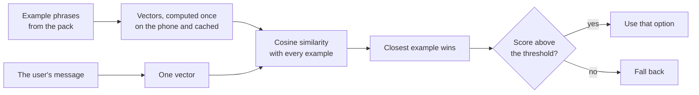

# How the AI works

What the two models do in Hudyat, how each decision is made, what was
measured, and what the AI is not allowed to do.

- **How the parts fit together:** [ARCHITECTURE.md](ARCHITECTURE.md)
- **Where the example phrases come from:** [DATA.md](DATA.md)

## In short

- Two open models run on the phone. We did not train or fine-tune them.
- One model **compares meaning**. It answers "which of these fixed
  options is this message closest to?"
- The other model **writes one or two sentences** under a result. It is
  optional, labelled, and checked before it is shown.
- Neither model supplies a fact. Phone numbers, places, websites and
  first-aid steps are copied from the data pack.

## The two models

| | EmbeddingGemma | Gemma 3 1B |
|---|---|---|
| File | `embeddinggemma-300M_seq256_mixed-precision.tflite` | `Gemma3-1B-IT_multi-prefill-seq_q4_ekv4096.litertlm` |
| Kind | Embedding model: text in, a list of numbers out | Chat model: text in, text out |
| Used for | Three decisions | One optional note |
| Runs through | `flutter_edge_ai_embeddings` (LiteRT) | `flutter_edge_ai_litertlm` (LiteRT-LM) |
| If missing | Keyword search and rules take over | No note is shown |

## Part 1: comparing meaning

### The method

An embedding model turns a sentence into a vector, a list of numbers that
stands for its meaning. Two sentences that mean similar things get
vectors that point in a similar direction, even with no words in common.

1. **Examples.** Each fixed option has a handful of example phrases in
   Taglish, Filipino and English.
2. **Prepared once.** The phone computes a vector for every example and
   saves them. This takes about a second per phrase, so it happens in the
   background after start-up. The saved vectors are reused until the
   phrases change.
3. **One message, one vector.** A typed or received message is turned
   into a vector the same way.
4. **Nearest example.** The message is scored against every example by
   cosine similarity, a number where 1 means the same direction. An
   option is as close as its single nearest example. On the phone this
   beat averaging an option's examples.
5. **Threshold.** If the best score is too low, the app does not guess.

The output is always the id of a fixed option and a score. It is never
text.

### The three decisions

| Decision | Options | Threshold | If nothing passes |
|---|---|---|---|
| What does the user need? | 9 needs, 10 examples each | 0.49 | Keyword search |
| Which first-aid card fits? | 8 cards | 0.56 | No first-aid card is shown |
| Does this read like a scam? | 42 scam phrasings | 0.56 | No wording reason is added |

### How the thresholds were set

- **Need (0.49).** Measured on the Infinix on 2026-10-09 with 33 test
  messages. Real emergencies scored 0.506 or more, and small talk scored
  0.470 or less. The threshold sits between them.
- **Scam wording (0.56).** Measured on the Infinix on 2026-10-09 with 20
  held-out scam messages and 25 ordinary ones. The closest ordinary
  message scored 0.546, so the threshold is the lowest value that flags
  none of them. At that value 12 of the 20 scam messages are caught.
- **First-aid card (0.56).** Not measured on the phone. It starts at the
  scam check's value, on the strict side, because showing the wrong first
  aid is worse than showing none.

All test messages were written for the project. These figures show how
the thresholds were chosen. They are not real-world accuracy.

### One safety rule on top

If a calm need wins (clinic or medicine) but an urgent one (medical
emergency or injury) scores within 0.04 of it, the urgent one is used.
Sending a possible emergency to a list of clinics is the costlier
mistake.

## Part 2: the message check

The wording comparison is one of four checks, and the only one that uses
AI.

| Check | Method |
|---|---|
| Links | Rules, against official websites in the pack |
| Claimed sender | Rules, against organisations in the pack |
| Gambling promo | Rules, against a hand-made list |
| Wording | EmbeddingGemma, against 42 scam phrasings |

- **The AI cannot accuse on its own.** A wording match alone gives
  "Mag-ingat". "Mukhang scam" needs a hard rule finding, or two different
  reasons.
- **The AI cannot clear a message.** There is no "safe" verdict.
- **The background guard uses no AI.** Messages checked on arrival get
  the rules only. The wording check runs when the app is open.

## Part 3: the written note

Gemma 3 1B writes one or two sentences under a help card or a flagged
result. The card or result is already complete without it.

### What the model is given

A short instruction and a list of facts taken from the screen.

| For a help card | For a message result |
|---|---|
| The need, the city, the first hotline's name, the nearest place and its distance | The verdict and the fixed reasons |

**Phone numbers, sender numbers and contact details are left out on
purpose.** The model cannot repeat what it was never given.

The instruction for a help card reads, in part: "Use only the FACTS. Do
not add phone numbers, names, places or steps that are not in the FACTS.
Do not give medical advice." For a result it adds: "Never say the message
is safe."

### What happens to its answer

The text is checked as it streams. The whole note is thrown away if:

- it contains a number of three or more digits that is not in the facts;
- for a result, it uses a word such as "safe", "legit", "ligtas" or
  "lehitimo";
- for a result, it names a link that is not in the facts.

The note also stops quietly if the model is missing, fails, or pauses for
more than 12 seconds.

### Limits

- **Length:** at most 80 tokens of output, within a 1,024-token context.
- **Language:** the notes are written in English.
- **Label:** every note is shown in a dashed box marked as AI-written.

## What the AI never does

| The AI never | Because |
|---|---|
| Writes a phone number, address, website or first-aid step | These are copied from the pack |
| Decides who a message really came from | That is a lookup against known organisations |
| Marks a message "Mukhang scam" by itself | A small model is wrong too often to accuse alone |
| Says a message is safe | It can miss scams |
| Gives medical advice | The first-aid steps are fixed text from cited sources |
| Runs in the background | The guard uses rules, to stay light and reliable |
| Sends anything off the phone | Both models run locally and the app has no server |

## Where everything runs

- **On the phone.** Both models, every comparison and every note.
- **No cloud AI.** The app calls no AI service.
- **Vectors match the model.** Example vectors are computed on the same
  phone and model that scores the message, never shipped from a laptop.

## The classifier that is switched off

The repository also contains tooling for a trained five-label classifier
that would say what a message asks for (credentials, money, an action,
pressure, bait). It is **not active** in the app:

- no trained classifier file is in the pack, so the app uses the wording
  check described above;
- it has not been measured on independent real messages;
- the rule for switching it on is that it must beat the wording check on
  held-out messages with no extra false alarms.

Its training examples (`pack/data/ask_examples.json`) are synthetic. Its
test material (`pack/data/collected_scams.json`) is 29 scam texts quoted
on public pages, mostly blogs, each with its source link. Details
are in [pack/classifier/README.md](../pack/classifier/README.md).

## Known weaknesses

- **Small test sets.** Thresholds come from tens of messages, all
  written for the project.
- **Modest recall.** The wording check caught 12 of 20 test scams.
- **First-aid matching is unmeasured** on the phone.
- **Taglish coverage is uneven.** A message phrased far from every
  example can fall through to keyword search.
- **The note can still be wrong** in ways the checks do not catch, which
  is why nothing depends on it.

## Where to look in the code

| Topic | File |
|---|---|
| Loading the models | `lib/core/models/edge_ai_runtime.dart`, `model_manager.dart` |
| Example vectors and cosine similarity | `lib/core/models/example_vectors.dart` |
| Need matching | `lib/features/intent/services/intent_matcher.dart` |
| First-aid matching | `lib/features/intent/services/first_aid_matcher.dart` |
| Scam wording | `lib/features/check/services/scam_phrases.dart` |
| Note prompts | `lib/features/card/services/explainer.dart`, `lib/features/check/services/result_explainer.dart` |
| Note checks | `lib/core/models/guarded_note.dart` |
