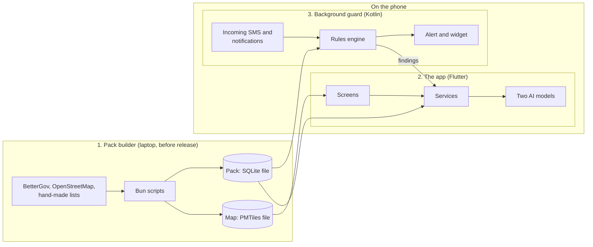
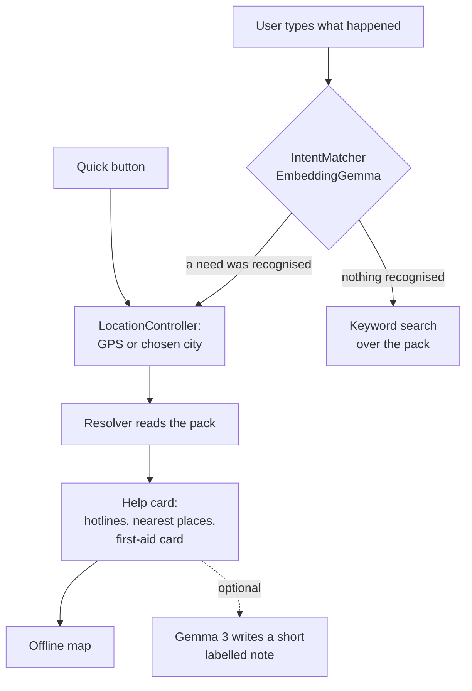
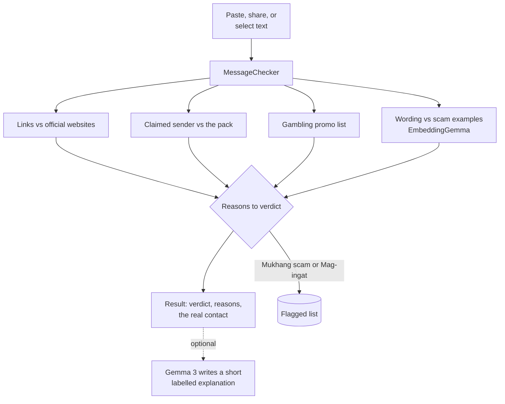
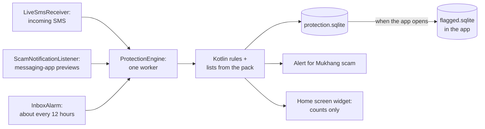

# How Hudyat works

A high-level view of the parts and how they fit together. For the full
design, see the [design spec](superpowers/specs/2026-10-09-hudyat-design.md).
For where the data comes from, see [DATA.md](DATA.md).

## The idea in one paragraph

Hudyat separates **knowing** from **understanding**. Everything the app
knows (phone numbers, places, official websites, first-aid steps) is
fixed data in a file called the pack. The AI models only understand what
the user typed or received, and point to the right piece of that data.
The AI never writes a fact.

## The three parts

| Part | Runs | Job |
|---|---|---|
| Pack builder | On a laptop, before release | Turns open data into the pack and the map |
| The app | On the phone, while open | Screens, lookups, both AI models |
| Background guard | On the phone, even when the app is closed | Checks incoming messages with rules and raises alerts |

## 1. The pack builder

Lives in `pack/`. It is a set of Bun and TypeScript scripts.

- **`fetch`** downloads the source files.
- **`build`** converts them, adds the hand-made lists in `pack/data/`,
  and writes one SQLite file.
- **`map`** cuts the offline map for Metro Manila.

The pack holds these tables:

| Table | Contents |
|---|---|
| `records` | Every hotline, agency, official, service and place |
| `records_fts` | A keyword index over `records` |
| `intents` | The fixed list of needs, with example phrases |
| `first_aid_cards` | Fixed first-aid steps and their sources |
| `official_senders` | Organisations scammers pretend to be, with their real websites and numbers |
| `scam_examples`, `scam_reasons` | Scam wording examples, and the fixed sentences shown as reasons |
| `meta` | Build date, sources, and the lists the message rules use |

The pack and the map ship inside the app. On first run the app copies
them to its own storage so SQLite and the map can open them.

## 2. The app

Lives in `lib/`. Shared building blocks are in `lib/core/`, and each
feature has its own folder in `lib/features/`.

### Core services

Created once at start-up and shared with every screen (`AppScope`).

| Service | Job | Uses AI |
|---|---|---|
| `PackStore` | Reads the pack: keyword search and lookups by kind and city | No |
| `ModelManager` | Loads the two models and reports whether each is ready | Loads them |
| `IntentMatcher` | Turns a typed message into one need from the fixed list | EmbeddingGemma |
| `FirstAidMatcher` | Picks a first-aid card for a message, if one fits | EmbeddingGemma |
| `LocationController` | Finds the city from GPS, or asks the user to pick one | No |
| `Resolver` | Builds a help card from a need and a city | No |
| `MessageChecker` | Checks a message and returns a verdict with reasons | Rules, plus EmbeddingGemma for wording |
| `Explainer`, `ResultExplainer` | Write one or two sentences under a card or result | Gemma 3 1B |
| `FlaggedStore` | Keeps flagged messages on the phone | No |
| `InboxScanner` | Checks texts already in the SMS inbox | Rules, then wording |

### Flow A: asking for help

1. The message is turned into a vector and compared with the example
   phrases for each need. The closest need wins if it is close enough.
2. The city comes from GPS, or from a list when there is no fix.
3. `Resolver` reads the pack. Hotlines are taken for the city, then the
   province, then nationally. Places are sorted by straight-line
   distance.
4. The card shows at once. It does not wait for the chat model.
5. If the chat model is ready, it adds a short note from the card's
   facts. A note that contains a number the card does not have is
   dropped.

### Flow B: checking a message by hand

- Three of the four checks are rules that compare the message with the
  pack. They need no model.
- The wording check is the AI part. It can raise a message to
  "Mag-ingat" but never to "Mukhang scam" on its own.
- The verdict comes from a fixed table of reasons. Each reason is a
  fixed sentence filled in with pack data.

## 3. The background guard

Lives in `android/app/src/main/kotlin/`. It is written in Kotlin so it
can run when the Flutter app is closed.

- **Three ways in:** an SMS arriving, a notification from a chosen
  messaging app, and a scheduled check that catches anything missed.
- **Rules only.** The guard does not start Flutter or load a model, so
  it stays light. The AI wording check runs later, when the app is open.
- **Its own database.** The guard writes to `protection.sqlite`. The app
  copies findings into `flagged.sqlite` when it opens. They are separate
  files because two SQLite libraries cannot safely share one.

### One set of rules, two languages

The message rules exist in Dart (for the app) and in Kotlin (for the
guard). Dart is the source of truth. A Dart test writes the expected
verdict for several hundred messages to a file, and a Kotlin test must
reproduce every one. A rule changed in Dart and forgotten in Kotlin
fails the tests.

## Where the AI sits

| Step | Model | What it decides | What it cannot do |
|---|---|---|---|
| Understand a typed request | EmbeddingGemma | Which need, from a fixed list | Write an answer |
| Pick a first-aid card | EmbeddingGemma | Which card, if any | Write or change a step |
| Judge a message's wording | EmbeddingGemma | Whether it resembles scam wording | Mark a message "Mukhang scam" alone |
| Write the short note | Gemma 3 1B | The wording of one or two sentences | Add a number, or change a card or verdict |

Both models run through `flutter_edge_ai` on the phone. Vectors for the
example phrases are computed once on the phone and cached.

## When something is missing

Each part fails on its own without taking the rest down.

| Missing | What still works |
|---|---|
| EmbeddingGemma | Quick buttons, keyword search, and the three rule checks |
| Gemma 3 1B | Everything except the short AI notes |
| GPS fix | Cards, after the user picks a city. Distances are hidden |
| Map file | Cards and place lists |
| Message permissions | Checking a message by paste, share or selection |
| Internet | Everything except opening a website or another maps app |

## What is stored on the phone

| File | Written by | Contents |
|---|---|---|
| The pack | Copied from the app on first run | Fixed data. Never changed by the app |
| The map | Copied from the app on first use | The offline base map |
| `flagged.sqlite` | The app | Flagged messages, and which texts a scan has already checked |
| `protection.sqlite` | The background guard | Its findings and counts |
| Cached vectors | The app | Vectors for the example phrases |

Nothing is sent off the phone. The app has no server.

## Where to look in the code

| To understand | Start at |
|---|---|
| How services are wired | `lib/core/app_scope.dart`, `lib/main.dart` |
| Typed request to a need | `lib/features/intent/services/intent_matcher.dart` |
| Building a help card | `lib/features/card/services/resolver.dart` |
| The message rules | `lib/features/check/services/message_checker.dart` |
| The wording check | `lib/features/check/services/scam_phrases.dart` |
| The background guard | `android/app/src/main/kotlin/com/example/hudyat/ProtectionEngine.kt` |
| Building the pack | `pack/src/build.ts`, `pack/src/sources/` |
