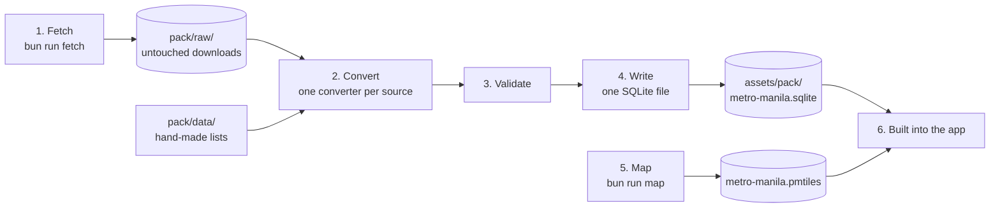

# From sources to the pack

How Hudyat's data gets from public sources into the file the app reads.
Every step is a script in `pack/`, so anyone can rerun it and compare.

- **What the sources are:** [DATA.md](DATA.md)
- **How the app uses the pack:** [ARCHITECTURE.md](ARCHITECTURE.md)

## The steps

| Step | Command | Script | Needs internet |
|---|---|---|---|
| Fetch | `bun run fetch` | `pack/src/fetch.ts` | Yes |
| Convert, validate, write | `bun run build` | `pack/src/build.ts`, `pack/src/write.ts` | No |
| Map | `bun run map` | `pack/src/map.ts` | Yes |

Steps 2 to 4 run with no connection, on the files step 1 saved.

## 1. Fetch

`fetch.ts` downloads each source file and saves it unchanged in
`pack/raw/`. That folder is not in Git.

| Source | What is downloaded |
|---|---|
| `bettergovph/bettergov` | 5 directory files, 16 regional LGU files, 13 service files, `philippines_hotlines.json`, `websites.json` |
| `bettergovph/hotlines` | `hotlines.json` |
| OpenStreetMap | One Overpass query, `pack/src/overpass.ql`, saved as `overpass.json` |

- **No scraping.** Every file is a published JSON file or an API reply.
  No web page is parsed.
- **Cached.** A file that is already in `pack/raw/` is not downloaded
  again unless `--force` is passed.
- **Identified.** The Overpass request names itself as
  `hudyat-pack-builder/0.1`.

## 2. Convert

Each source has one converter in `pack/src/sources/`. A converter turns
the source's rows into one shared shape, a record:

`kind`, `name`, `category`, `region`, `province`, `city`, `phones`,
`address`, `lat`, `lon`, `url`, `parent`, `source`

Every record keeps the name of the source it came from.

| Converter | Reads | Produces | What it decides |
|---|---|---|---|
| `directory.ts` | Directory files | Agencies | The name and phone fields differ between files, so it tries each known field name |
| `directory.ts` | LGU files | Officials | Takes the mayor and vice mayor of each city or municipality |
| `hotlines.ts` | Both hotline files | Hotlines | Maps each source category to one of ours; an office with "DRRM", "rescue" or "emergency" in its name becomes a disaster hotline |
| `osm.ts` | Overpass reply | Places | Keeps hospitals, clinics, pharmacies, police, fire stations and shelters; drops a place with no name or no coordinates |
| `services.ts` | Service files | Services | A service is only a title and a link, so it borrows the phone numbers of the agency whose website it is on |
| `senders.ts` | `websites.json`, `companies.json` | Official senders | Works out each agency's acronym from its domain; leaves out schools and embassies |

### Rules that apply to every source

- **Duplicates are merged.** National hotlines repeated across groups
  become one record. A city hotline with the same city, name and number
  is kept once. An OpenStreetMap element is kept once.
- **City names are made consistent.** "City of Las Piñas", "Las Pinas
  City" and "las piñas" become one spelling (`pack/src/cities.ts`), so a
  hotline and a hospital in the same city match.
- **Phone numbers are never guessed** (`pack/src/phones.ts`). The number
  is always kept as the source wrote it, for display. A dialable form is
  added only when it is certain:
  - mobile numbers, and landlines written with an area code;
  - 8-digit numbers, which only Metro Manila has, get the 02 area code;
  - short codes such as 911, for hotline sources only;
  - fax lines, "text only" numbers and 7-digit numbers get no Call
    button, because they cannot be dialled as written.
- **Nothing is invented.** A missing phone, address or website stays
  empty.

### Judgement calls worth knowing

- **Shelters.** `amenity=shelter` in OpenStreetMap is mostly waiting
  sheds, so only assembly points and shelters for displaced people count.
- **The MMDA hotline** is treated as Metro Manila only, not national.
- **Agency acronyms** that are also ordinary words are blocked by hand
  (`sender_rules.json`), so a normal sentence is not read as naming an
  agency.
- **A company beats an agency** when both list the same website, as with
  Landbank.

## 3. Hand-made lists

Some data has no public source, so it is kept as reviewed JSON files in
`pack/data/` and added during the build.

They cover the fixed needs, first-aid cards, company senders, sender
rules, the gambling list, scam wording and the reason sentences. Each
file and how it was made is listed in [DATA.md](DATA.md).

Four files in `pack/data/` are **not** in the pack: classifier training
and test material, and test messages.

## 4. Validate and write

`write.ts` refuses to build a pack that breaks a rule. The build stops
with an error if:

- a record has no kind or no name;
- a place has no coordinates;
- a first-aid card has no title, steps, source or enough examples, or an
  id is repeated;
- an official sender has no name, no domain or nothing to match on;
- a company phone number has no source page;
- a gambling entry is empty.

Then it writes one SQLite file:

| Table | Filled from |
|---|---|
| `records` | All converted records |
| `records_fts` | A keyword index over `records` that ignores accents |
| `intents` | `intents.json` |
| `first_aid_cards` | `first_aid.json` |
| `official_senders` | Agencies from `websites.json` plus `companies.json` |
| `scam_examples`, `scam_reasons` | The files of the same names |
| `meta` | Build date, map area, the source list with licences, and the rule lists |

- **The build date** is the day the script ran. The app shows it on
  every card.
- **The source list** in `meta` is what the app shows as credits.
- **A rules version** is a fingerprint of the message-check lists. When
  the lists change, the app rechecks texts it had already scanned.

The last build wrote 469 hotlines, 295 agencies, 2,460 officials, 194
services, 3,206 places, 263 official senders and 8 first-aid cards.

## 5. The map

`map.ts` finds the newest Protomaps daily build from the last 7 days and
runs `pmtiles extract` on it for the box 120.90–121.16 °E, 14.34–14.80 °N
at a maximum zoom of 15. The result is one file of about 53 MB.

## 6. Onto the phone

- **Bundled.** The pack and the map are inside the app, so a new install
  needs no download.
- **Copied once.** SQLite and the map need real files, so the app copies
  them to its own storage. The pack is copied only when it has changed,
  and the new copy replaces the old one in a single step.
- **Read-only.** The app never writes to the pack.

## What is tested

`bun test` in `pack/` runs 59 tests over the phone parsing, the
converters, the sender list and the pack writer.

## How to check our work

1. Run `bun run fetch --force`, then `bun run build`.
2. Open `assets/pack/metro-manila.sqlite` in any SQLite viewer.
3. Compare any record with its source. The `source` column says where it
   came from, and `pack/raw/` holds the file it was read from.

A later build can differ from ours, because the sources change over time.
